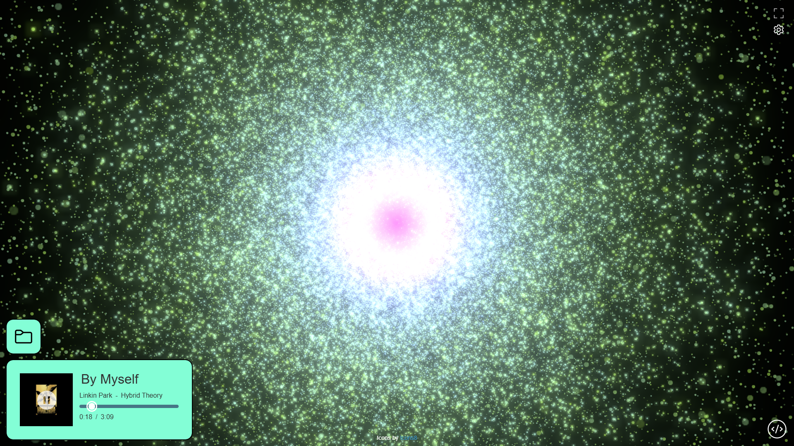

# [Music Visualiser](https://cookiemonsternz.github.io/music-visualiser/)

This is a particle based, ThreeJS music visualiser I made over the course of about two weeks. 
It utilizes [ThreeJS](https://threejs.org/), WebGPU, and WebAudio to dynamically playback and visualise audio files, and creates (what I think) are asthetically
pleasing visuals. Hope you enjoy! :)
***
## To Use
- Load [the website.](https://cookiemonsternz.github.io/music-visualiser/)
- Press play! (The button's in the album cover ;)).

**To load a file:**
- Press the load button.
- Select an appropriate audio file (.mp3, .wav, etc...).

### **Please check out the settings!**
They contain settings for number of particles, color themes, and more!
**If it is lagging, try reducing the particle count!**

- *Please note, upon changing the number of particles, you need to load the file again, if using the pre-loaded file, just change the number before pressing play.*

- *The volume slider also determines the intensity of particle movement, so keep this in mid and adjust for different master volumes of audio files, although it should be fine for most.*

## Features!
- Dynamic visual generation.
- Optimized particle computation using ThreeJS WebGPU compute shaders.
- Multiple *exciting* color schemes (feel free to add more :)).
- Local audio file loading.
- Album cover retrieval using [MusicBrainz API](https://musicbrainz.org/doc/MusicBrainz_API) (Using only file metadata!).
- **VOLUME SLIDER!**
- ***Psychotic Mode.***

## Known Bugs
- [X] Playback time does not pause when audio playback is paused, stops counting but upon starting audio again time jumps forward.
- [X] Even when no song is loaded hovering off the play button dims the UI.

## Feature plans
- [X] Color Schemes.
- [X] Collapsible settings menu.
- [X] Volume Slider.
- [ ] Audio seeking; requires rework to use WebAudio instead of ThreeJS for audio loading.
- [ ] Google search for album covers when not found on MusicBrainz.
- [ ] Mobile UI.
- [ ] Intensity slider.

## Running Locally
1. Download or clone the repo to a local folder.
2. Run the HTML file on a local server. I used [Live Server for VSCode](https://marketplace.visualstudio.com/items?itemName=ritwickdey.LiveServer).

***
please don't sue me warner bros records